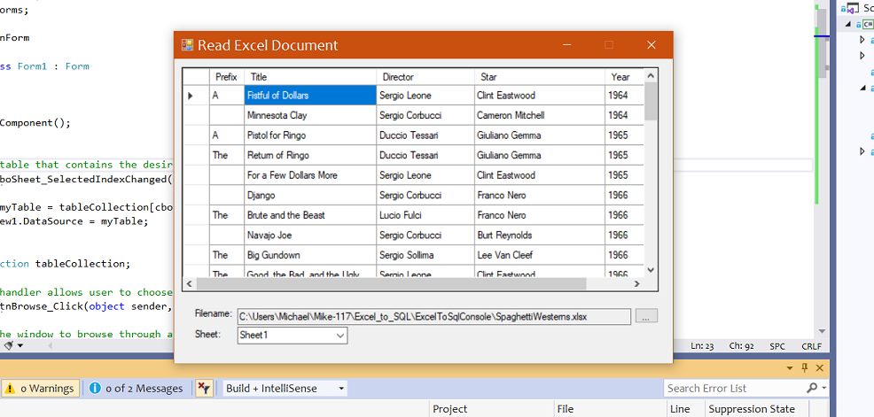

# Excel to SQL
 This is a console application that takes an existing Excel worksheet and translates it into a SQL Database.
 
 My initial desire was to use a single C# method to perform the operation, so I searched for an appropriate one. My research led me to the OLE DB Provider, and I tested various examples of it in action. But none of these worked for me, and with some added research I discovered that the method had been deprecated, and would no longer work.
 
 With time on the project running short, I decided not to look into any new methods but apply what I already knew. So I constructed two programs - a method to turn an Excel .xlsx file into a C# datatable, and another one to turn a C# datatable into a SQL database table. Then I simply combined them into one program, and I got the result I wanted.
 
 # Update
 The original program had several drawbacks: the user had to type in the full filename of the Excel worksheet; the datatable columns had to be preprogrammed to a specifice worksheet; the same with the databse. While it worked to make a specific Excel worksheet into a SQL database table, it was extremely limited in its usablity.
 
 I decided to refactor it as a Windows Form app, wherein the user could choose the file and all the data would be automatically converted to a C# datatable for reading, and a SQL database table for storage. I was able to complete the first half of the operation, using the ExcelDataReader library.
 
 
 
 The second part eluded me. While I learned how to populate the database automatically, I still had to write the database attributes manually. I have yet to discover a method that will encapsulate that process based solely on user input. When I discover that I will add another update.
 
 # Yes, I know...
 There are currently any number of APIs out there that converts an Excel spreadsheet into a C# datatable, including EPPlus, SpreadSheetLight, and EasyXLS. You can also convert an Excel document into a SQL database table using the Import Wizard in SSMS, bypassing C# altogether. But I wanted to build something that does both jobs at once.
